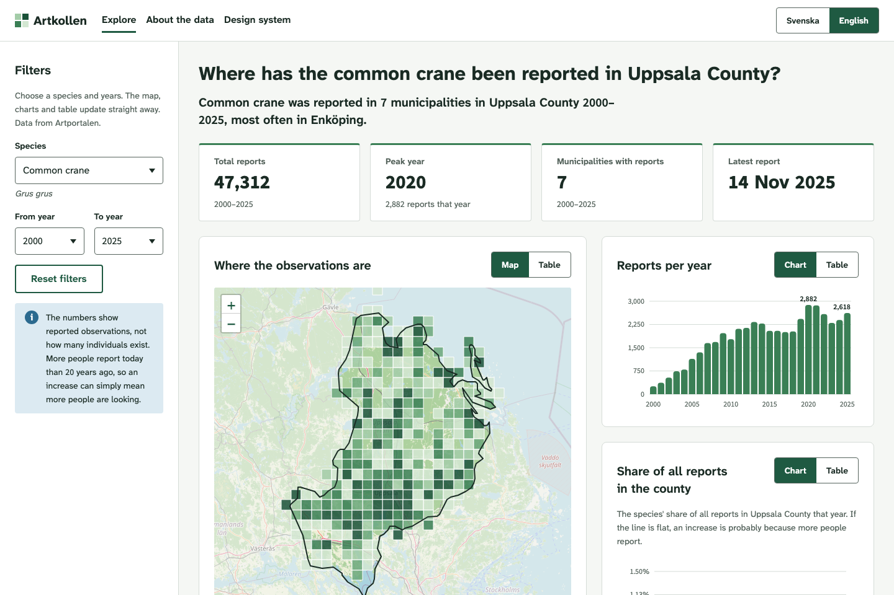

# Artkollen

A bilingual (Swedish/English) dashboard that shows where ten species have been reported in Uppsala County, how reports have changed since 2000, and the underlying records.

**Live demo:** [artkollen.vercel.app](https://artkollen.vercel.app)



**Independent prototype, not an SLU service.** Built by Vinoth K as a portfolio project on open research data.

## What it shows

The site has three pages, all in Swedish and English (switch in the top bar).

**Explore** (`/`)
- **Filter panel:** species (common name, with the Latin name below), from year, to year, and a reset button. From 1100 px wide the panel stays in view while you scroll; below that it opens from a "Filters" button.
- **Answer first:** a question as the heading, then a one-sentence answer, e.g. "Common crane was reported in 7 municipalities in Uppsala County 2000–2025, most often in Enköping."
- **Caveat:** a note that the numbers are reported observations, not population size.
- **Key figures:** total reports, peak year, municipalities with reports, latest report.
- **Map:** observations grouped into roughly 5 × 5 km squares on OpenStreetMap, with the county outlined and the area outside lightly faded. Can be switched to a table of squares.
- **Charts:** reports per year, share of all reports in the county (%), reports per month and reports per municipality. Every chart can be switched to a table.
- **Observations table:** sortable, 10 rows per page, with CSV download (semicolon-separated, UTF-8 with BOM so it opens correctly in Swedish Excel).
- **Shareable views:** the chosen species and years are kept in the address, e.g. `/?art=trana&fran=2010&till=2025`.

**About the data** (`/om`, `/about`): key facts, where the data comes from, what it cannot show, and an accessibility statement.

**Design system** (`/designsystem`, `/design-system`): work in progress. It currently documents colour (with live contrast checks), type, and spacing and radius. All values are read live from the stylesheet.

## Design decisions

- **Answer first.** The headline question and plain-language answer come before any chart, so a non-expert gets an answer without reading a chart.
- **Honest about the data.** The caveat stays visible next to the filters. The "share of all reports" line shows whether a species is really increasing or more people are simply reporting. Figures based on the sample say so.
- **Every visual has a text alternative.** The map and every chart switch to a table. Chart values are reachable with the arrow keys and announced to screen readers.
- **The grid is the signature.** The palette comes from Swedish terrain maps, and the map's grid squares are the one bold visual element. Everything else stays quiet.
- **One hue for data.** Map squares and bars use a single green scale, light to dark, so the scale reads without colour vision.
- **No layout shift.** Chart cards and the observations table have fixed-size areas, so switching to a table, sorting or paging never moves the rest of the page.
- **Names stay correct.** Place names are always in Swedish and marked `lang="sv"`, Latin names are marked `lang="la"`, and browser auto-translation is turned off (`translate="no"`). The site has its own language switch, and machine translation was mangling place names.
- **Self-hosted fonts.** No requests go to third-party font services.

## Data

- **Source:** [Artportalen](https://www.gbif.org/dataset/38b4c89f-584c-41bb-bd8f-cd1def33e92f), the Swedish Species Observation System run by SLU Artdatabanken, fetched through the GBIF API.
- **Licence:** CC0 1.0.
- **Fetched:** 2026-10-07, with `npm run fetch-data`, and stored as static JSON in `public/data/`.
- **Area and years:** Uppsala County, 2000–2025 (complete calendar years).
- **Species (10):** blåsippa (liverleaf), vitsippa (wood anemone), gullviva (cowslip), blomsterlupin (garden lupin), spansk skogssnigel (Spanish slug), citronfjäril (brimstone), sånglärka (skylark), trana (common crane), tornseglare (common swift), älg (moose).

**Exact figures vs the sample**
- **Exact (all 131,972 reports):** yearly totals, monthly counts and counts per municipality, all from GBIF's exact counts. The same goes for all reports in the county per year, which the share line uses. The latest report date is found by searching the last month with reports, so in a very busy month it can be a day or two early.
- **Sample:** the map and the observations table use up to 200 records per species and year, 27,452 records in total. They're taken as five blocks of 40 consecutive results from different parts of GBIF's result list. **The sample is not random.**

**Known limits**
- **Reported observations are not population size.** More reports can mean more people looking.
- **Heby municipality is not included.** It joined Uppsala County in 2007, but the boundary data GBIF uses (GADM) still places it in Västmanland.
- **Reports with no month** (e.g. only the year is known) count in the totals but not in the month chart. The number left out is shown under that chart.
- **Records dated 1 January** are shown in the table and CSV as the year with "date unknown", because such dates usually mean only the year is known. A few real 1 January sightings are therefore also shown without a date.
- **7 place names in the sample are cut off after 80 characters.** An earlier version of the fetch script shortened them. The script is fixed, but the data has not been fetched again.
- **Sensitive species:** Artportalen hides or blurs their coordinates.

## Accessibility

The target is WCAG 2.1 AA, the level Swedish law refers to through EN 301 549. The About page has the full accessibility statement, including known issues. The site **partially conforms**: for example, individual map squares cannot be reached by keyboard, so the same data is offered as a table.

**Automated testing (in this repository):**
- `npm run test:a11y` (`tests/a11y.mjs`) runs [axe-core](https://github.com/dequelabs/axe-core) 4.13.0 through Playwright in Chromium, with the WCAG 2.0 and 2.1 A and AA rules, and also checks for sideways scrolling. It makes 74 checks:
  - **Pages:** Explore (default, with every table view open, and with the mobile filter panel open), About, and Design system
  - **Languages:** Swedish and English
  - **Widths:** 1920, 1440, 1100, 1099, 768, 700, 699 and 320 px
- `npm run test:keyboard` (`tests/keyboard.mjs`) checks, in both languages:
  - tab order and the "Skip to results" link
  - focus after sorting and paging
  - focus staying on the pagination buttons at both ends
  - opening and closing the mobile filter panel with Enter, Space and Escape

The last run (2026-10-07) passed all 74 axe checks and all 30 keyboard checks.

**Not covered by the tests:** browsers other than Chromium, zoom in a real browser, items axe marks for manual review (mostly colour contrast it cannot calculate), the OpenStreetMap background images, and states such as changed filters, keyboard use of the charts, and the map.

**Manual testing:** no manual testing with a keyboard or a screen reader has been done yet. It is planned.

## Design system

Design tokens are CSS custom properties in [`src/styles/tokens.css`](src/styles/tokens.css): colour, spacing, radius and type.

- **Type:** [Atkinson Hyperlegible Next](https://www.brailleinstitute.org/freefont/) for all text. **Digits 0–9 come from Source Sans 3**, through a font limited to those characters (`src/styles/digits.css`), for a plain zero without a slash. Tables use tabular figures so numbers line up.
- **Components:** segmented toggle, filter panel with a disclosure button, select fields with visible labels and hint text, info box, stat tiles, card with a chart/table toggle, column, bar and line charts, data table, observations table with sort buttons, pagination and CSV export, map, skip links, and a `Name` component that marks proper names for language and translation.
- **Buttons:** secondary and small are used on the site. A primary style is defined but not used yet.

## Run and test locally

Requires Node.js 20.19 or newer.

```bash
npm install
npm run dev            # development server, http://localhost:5173
npm run build          # production build into dist/
npm run preview        # serve the build, http://localhost:4173
```

Accessibility and keyboard tests (with `npm run preview` running in another terminal):

```bash
npx playwright install chromium   # once, downloads the test browser
npm run test:a11y                 # axe rules and sideways scrolling
npm run test:keyboard             # tab order, skip link and focus checks
```

Refresh the data from GBIF (takes a few minutes and replaces the files in `public/data/`):

```bash
npm run fetch-data
```

`vercel.json` contains a rewrite so that page addresses such as `/about` work on refresh when the site is deployed on Vercel.

## Credits and licences

- **Code:** MIT, see [LICENSE](LICENSE).
- **Observation data:** Artportalen (SLU Artdatabanken) via [GBIF.org](https://www.gbif.org/), CC0 1.0.
- **Map tiles:** © [OpenStreetMap](https://www.openstreetmap.org/copyright) contributors, data under ODbL. Tiles are used under the OpenStreetMap Foundation's tile usage policy.
- **County outline:** [Natural Earth](https://www.naturalearthdata.com/), public domain.
- **Fonts:**
  - Atkinson Hyperlegible Next (Braille Institute), SIL Open Font License 1.1
  - Source Sans 3 (Adobe), SIL Open Font License 1.1
  - both self-hosted through Fontsource
- **Libraries:**
  - [Leaflet](https://leafletjs.com/), BSD 2-Clause
  - React, React Router and Vite, MIT

Built with AI assistance (Claude Code).
